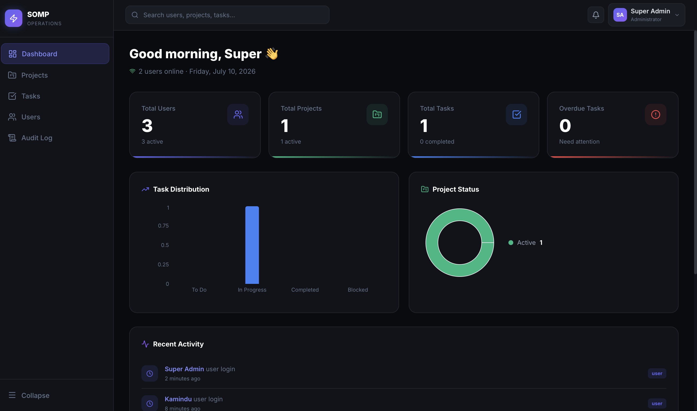
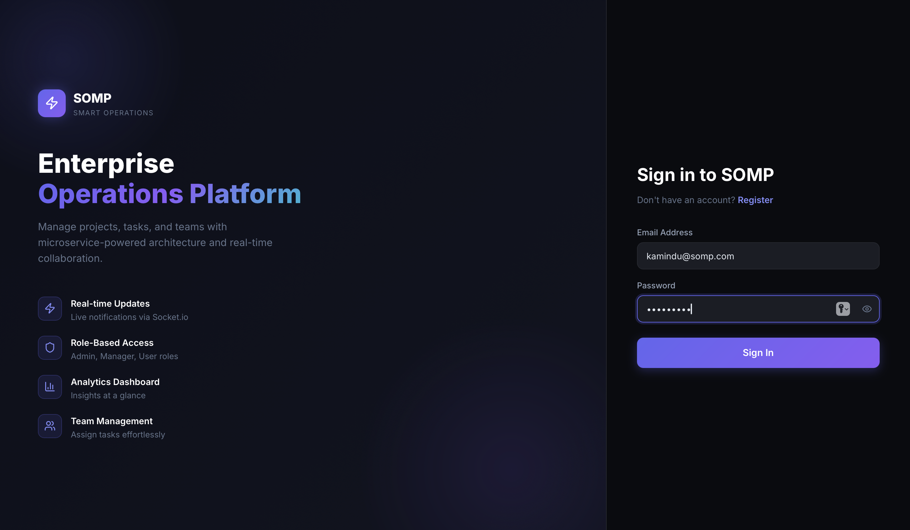
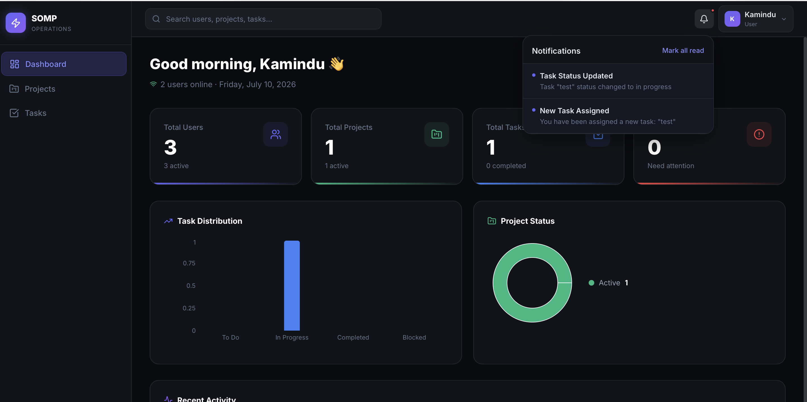
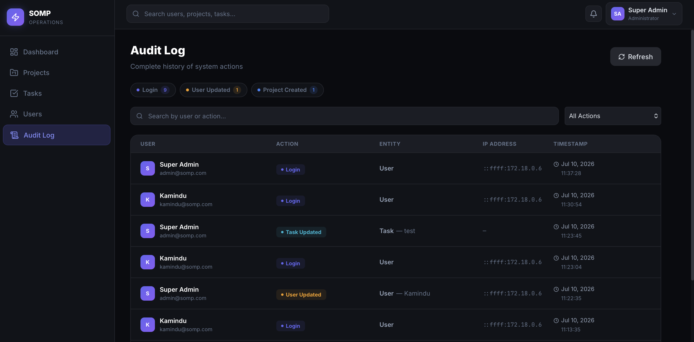
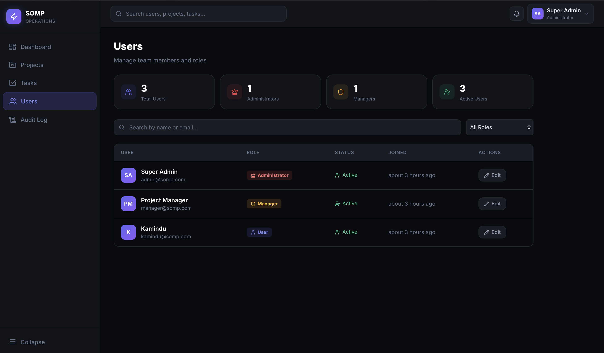

# smart-operations-management-platform
smart-operations-management-platform


## Start
### Run with Docker Compose

```bash
cd smart-operations-management-platform
docker-compose up --build
```

Then open: **http://localhost:3000**

### Demo Credentials

| Role | Email | Password |
|---|---|---|
| Administrator | admin@somp.com | Admin@123 |
| Manager | manager@somp.com | Admin@123 |
| General User | kamindu@somp.com | Admin@123 |


## Pages

## Dashboard



## Login Page



## Notifications



## Audit Log



## Users List



